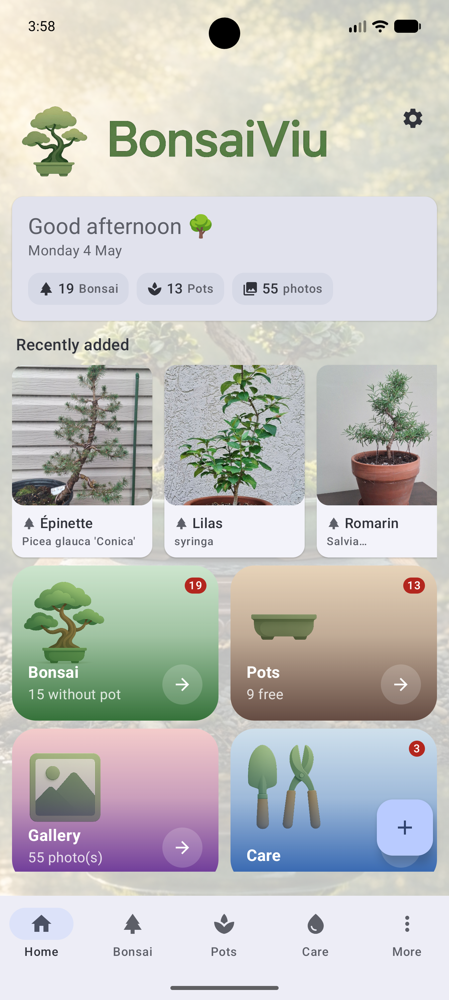
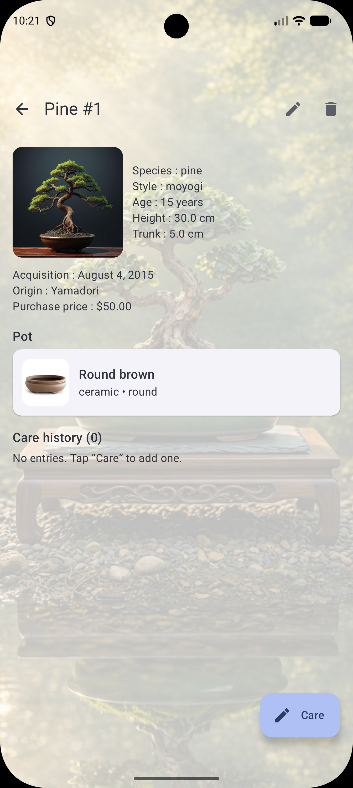
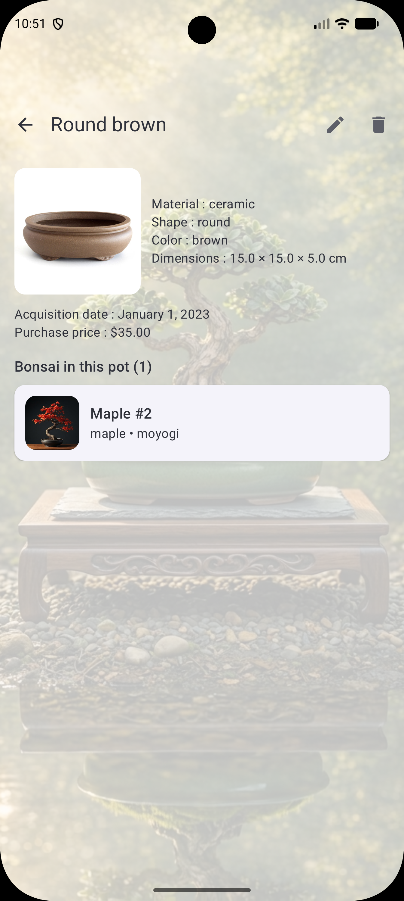
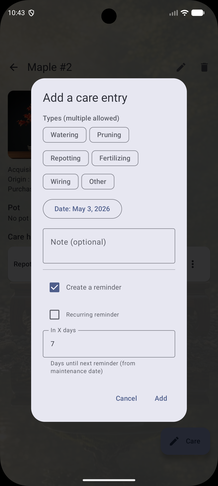
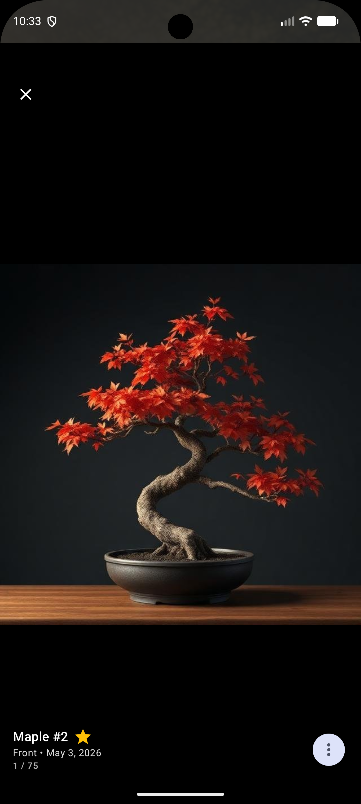
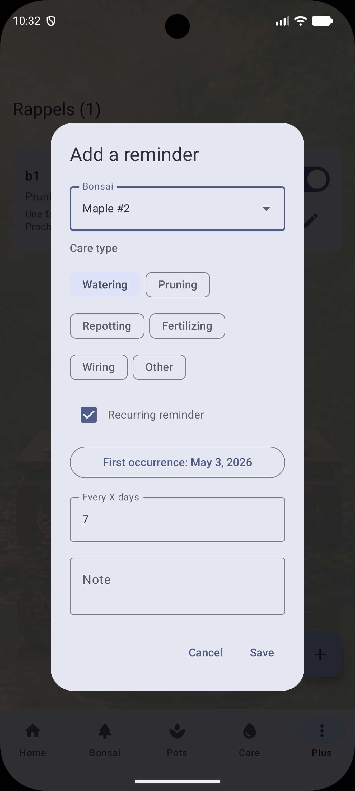

---

# 🌳 BonsaiViu  

**FR** - Une application Android moderne pour gérer votre collection de bonsaïs : photos, entretiens, rappels intelligents.  
**EN** - A modern Android app to manage your bonsai collection: photos, maintenance tracking, smart reminders.**

---

# 📥 Téléchargement / Download

- **APK direct** :  
  [bonsaiviu.v0.16.7.apk](https://github.com/93420/BonsaiViu/releases/download/BonsaiViu.v0.16.7/bonsaivio.v0.16.7.apk)

- **Toutes les versions / All releases** :  
  [Releases](https://github.com/93420/BonsaiViu/tags)

---

# ⚠️ Avant d’installer / Before Installing

**FR** — Avant une mise à jour majeure, fais une sauvegarde (`.bonsaibak`) au cas où.  
**EN** — Before any major update, make a backup (`.bonsaibak`) just in case.

---

# 📱 Installation (FR / EN)

## Prérequis / Prerequisites
- Android 10 (API 29) ou supérieur  
- ~100 MB d’espace libre  
- Android 10 (API 29) or higher  
- ~100 MB free storage

---

## 1) Autoriser les sources inconnues / Allow Unknown Sources

### Android 8+ (recommandé / recommended)

**FR**
1. Télécharge ou copie le fichier `.apk`.  
2. Ouvre-le depuis ton gestionnaire de fichiers.  
3. Android affiche un avertissement.  
4. Appuie sur **Paramètres**.  
5. Active **Autoriser cette source**.  
6. Reviens en arrière.

**EN**
1. Download or copy the `.apk` file.  
2. Open it from your file manager.  
3. Android shows a security warning.  
4. Tap **Settings**.  
5. Enable **Allow from this source**.  
6. Go back.

### Android 7 et antérieur / and earlier

**FR** : Paramètres → Sécurité → **Sources inconnues**  
**EN** : Settings → Security → **Unknown sources**

---

## 2) Installer l’APK / Install the APK

**FR**
1. Rouvre le fichier `.apk`.  
2. Appuie sur **Installer**.  
3. Attends quelques secondes.  
4. Appuie sur **Ouvrir** ou **Terminer**.

**EN**
1. Open the `.apk` again.  
2. Tap **Install**.  
3. Wait a few seconds.  
4. Tap **Open** or **Done**.

---

## 3) Désactiver les sources inconnues (recommandé)  
## Disable unknown sources (recommended)

**FR** — Pour la sécurité, désactive l’option après installation.  
**EN** — For security, disable the option after installation.

---

# 🔄 Mises à jour / Updates

**FR**
- Télécharge la nouvelle version  
- Réautorise temporairement les sources inconnues  
- Installe par-dessus l’ancienne (données conservées)  
- Désactive à nouveau les sources inconnues  

**EN**
- Download the new version  
- Temporarily allow unknown sources  
- Install over the existing app (data preserved)  
- Disable unknown sources again  

---

# 📸 Captures d’écran / Screenshots

| Accueil / Home | Bonsaï / Bonsai | Pot / Pot |
|---|---|---|
|  |  |  |

| Entretiens / Maintenance | Galerie / Gallery | Rappels / Reminders |
|---|---|---|
|  |  |  |

---

# 🧭 Guide des écrans / Screen Guide

Chaque section est FR puis EN pour une lecture parallèle.

---

## 🏠 Accueil / Home

**FR**
- Vue d’ensemble de la collection  
- Nombre total de bonsaïs  
- Catalogues par catégories  
- Navigation rapide  

**EN**
- Overview of your collection  
- Total bonsai count  
- Category-based catalogs  
- Quick navigation  

---

## 📚 Catalogues / Catalogs

**FR**
- Catégories personnalisées  
- Icônes configurables  
- Tri automatique  
- Ajout / modification / suppression  

**EN**
- Custom categories  
- Configurable icons  
- Automatic sorting  
- Add / edit / delete  

---

## 🌲 Détail / Detail

**FR**
- Infos complètes : nom, espèce, date, localisation  
- Galerie avec photo principale  
- Historique d’entretien filtrable  
- Actions rapides  

**EN**
- Full info: name, species, date, location  
- Gallery with main photo  
- Filterable maintenance history  
- Quick actions  

---

## ✏️ Édition / Edit

**FR**
- Formulaire complet  
- Assignation au catalogue  
- Validation des champs  
- Sauvegarde automatique  

**EN**
- Full form  
- Catalog assignment  
- Field validation  
- Auto-save  

---

## 📷 Photos / Photos

**FR**
- Ajout depuis galerie ou caméra  
- Définir la photo principale  
- Suppression  
- Grille optimisée  

**EN**
- Add from gallery or camera  
- Set main photo  
- Delete  
- Optimized grid  

---

## 🔧 Entretiens / Maintenance

**FR**
- Types : arrosage, rempotage, taille, fertilisation, traitement…  
- Historique complet  
- Rappels récurrents  
- Filtrage par bonsaï et type  

**EN**
- Types: watering, repotting, pruning, fertilizing, treatment…  
- Full history  
- Recurring reminders  
- Filter by bonsai and type  

---

## 🖼️ Galerie / Gallery

**FR**
- Plein écran  
- Zoom  
- Navigation par balayage  
- Infos sur la photo  

**EN**
- Full screen  
- Zoom  
- Swipe navigation  
- Photo info  

---

## ⏰ Rappels / Reminders

**FR**
- Rappels ponctuels ou récurrents  
- Association à un bonsaï  
- Notifications WorkManager  
- Activation/désactivation  
- Suppression par appui long  
- Alignement des dates pour les récurrences  

**EN**
- One-time or recurring reminders  
- Linked to a bonsai  
- WorkManager notifications  
- Toggle on/off  
- Long-press delete  
- Date alignment for recurring reminders  

---

# 💾 Sauvegardes / Backups

## Export / Import

**FR**
- Export → archive `.bonsaibak` (ZIP)  
  - `backup.json` (ExportPayload v4)  
  - `images/`  
- Import → restaure données + photos  
- Sauvegarde automatique optionnelle  

**EN**
- Export → `.bonsaibak` archive (ZIP)  
  - `backup.json` (ExportPayload v4)  
  - `images/`  
- Import → restores data + photos  
- Optional automatic backup  

---

## Notes importantes / Important Notes

**FR**
- Les sauvegardes manuelles nécessitent le mode développeur  
- Désinstaller l’app supprime toutes les données  
- Sauvegardez régulièrement  

**EN**
- Manual backups require developer mode  
- Uninstalling deletes all data  
- Back up regularly  

---

# 👤 Auteur / Author

Développé avec ❤️ pour les amateurs de bonsaïs  
Developed with ❤️ for bonsai enthusiasts

⭐ Si l’app vous plaît, laissez une étoile !  
⭐ If you enjoy the app, leave a star!

---
